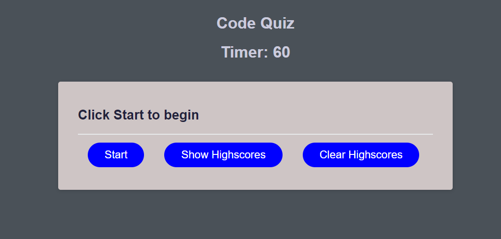
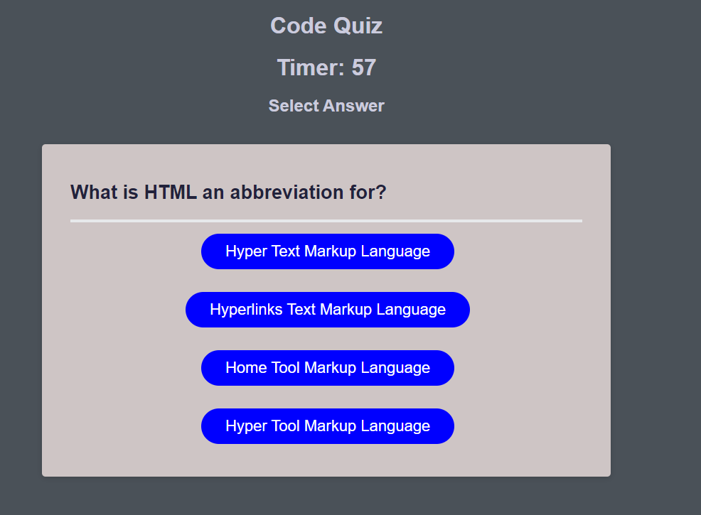
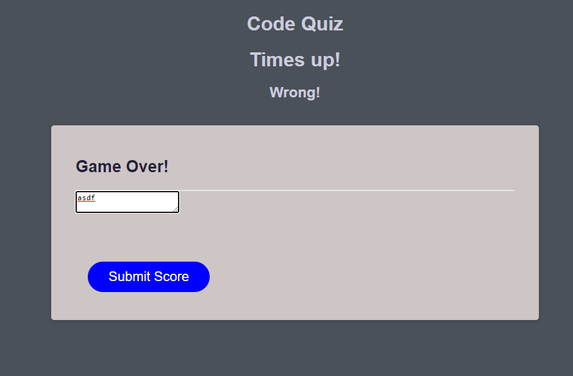
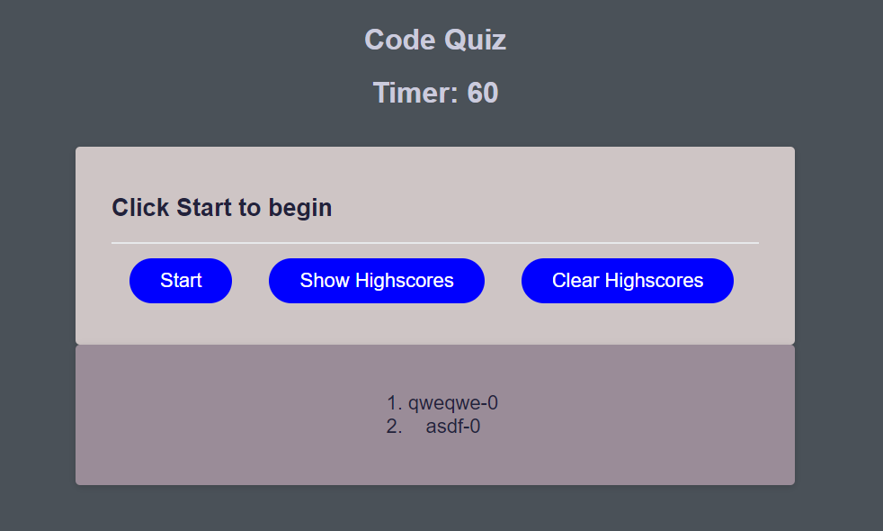
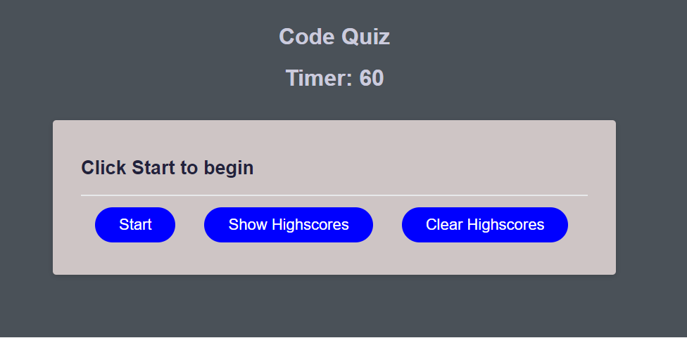

# Code-Quiz

## Description

This project was an atttempt at making a quiz to further our understanding of javascript and events.

## Table of Contents

 - [Installation](#installation)
 - [Usage](#usage)
 - [Credits](#credits)
 - [License](#license)

## Installation

To use this project the user needs to open the index.html in a browser. it can also be reached on github live pages from this link 

## Usage

To use this project, the user will begin by clicking on the start button. after that the user is prompted with a question and a descending timer. each time the user clicks an option the quiz will move on but if a wrong answer is selected 10 seconds will be deducted. The quiz is done when the timer runs out or the user has answered all the questions. At the end the user can input a tag and can show recorded highscores with the show high scores button.

## Credits

Robert Obernier
https://github.com/rjo6615

## License

N/A